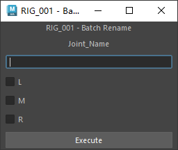
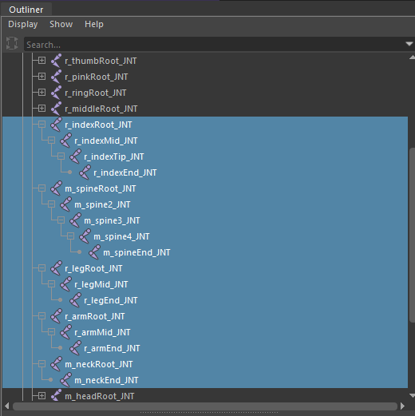
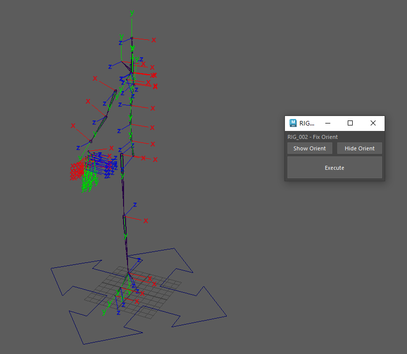
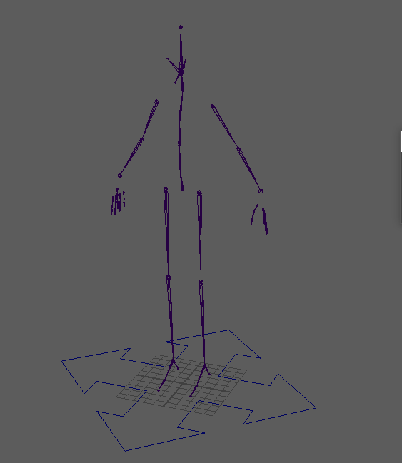
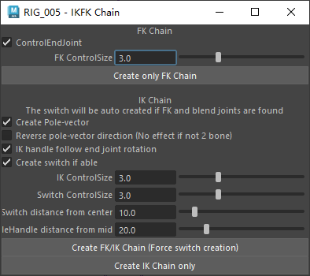
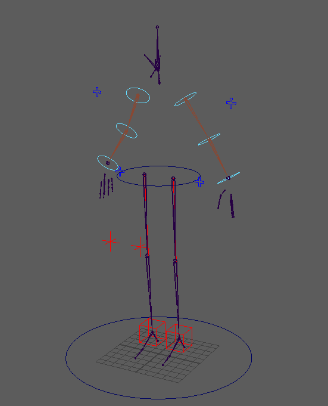
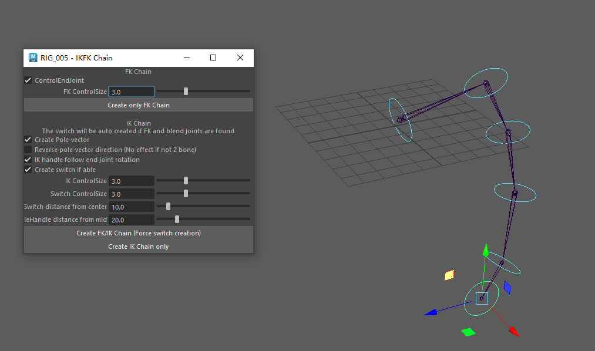
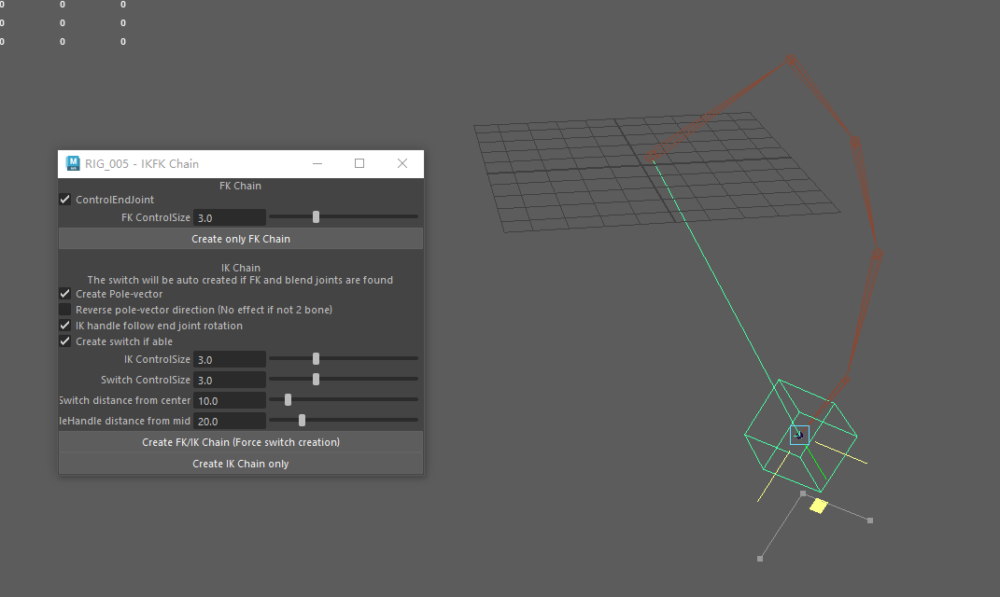
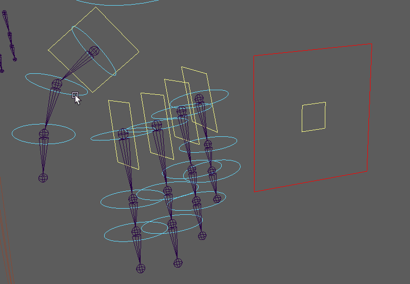
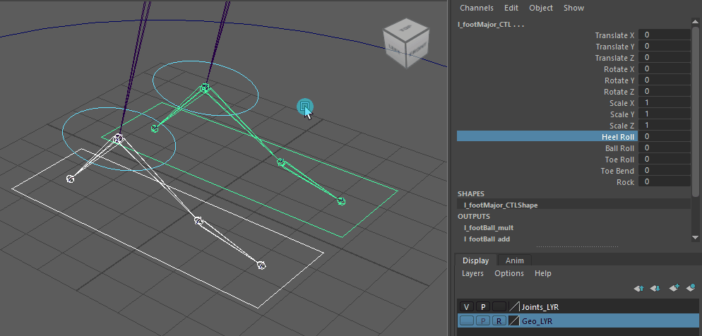

# DOFfer

Maya 二足绑定工具集

A stash of maya rigging scripts for biped rigging

## RIG_001 batch_rename

骨骼命名规范化工具

## RIG_002 joint_orient_fix

JointOrient规范化工具

|轴|倾向|
|---|---|
|x|Bend|
|y|Twist|
|z|Side|

## RIG_003/004 auto_mirror/grouper

镜像骨骼，确保肢体组结构规范

## RIG_005 IKFK

根据规范化结构自动生成所选肢体IKFK

支持任意长度骨链IKFK生成

## RIG_006 finger_rig/foot_rig

根据规范化结构自动生成手部控制器，包括单关节独立FK、单指major控制，全手major控制

自动生成足部控制器，包括toeRoll，heelRoll，ballRoll和Rock

## RIG_007 spine_rig

开发中
